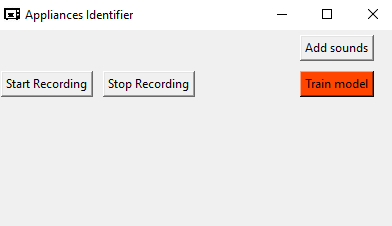

# Audio Recognition 

The following program is able to detect several audios and classify them in real-time. 

The program is made out of three stages:
 1. Recording stage: there is a built-in recorder that lets you easily record the sounds you want to include in the program. 
 2. Dataset creation and model testing: with the sound dataset created in the previous step, this stage is in charge of creating a useful database and trainnig ML and Deep Learning models in order to afterwards classify correctly. 
 3. Live recording UI: a live recorder is used to show on screen the detected sound by using the previous trained models. 
 

## Usage
From the project folder: 
 * To run the recorder: 
         
         python recorder/recorder_gui.py
        
 * To create the dataset from recorded sounds: 
        
        python model_desgin/dataset_making.py
        
 * To train models or generate a production model: 
 
        python model_design/main_models.py
        
 * To run the live-gui: 
 
        python main_ui/main_ui_live.py
       
From the last version deploy you only need to run the live-gui as you are able to access the other functionalities from 
it's built-in GUI. 

        
## Requirements

Install the requirement with the following command: 

        pip install -r requirements.txt
        
        
## Web version 

A simple web version is acessible via the below URL: 

  [Audio Recognition web page](https://audio-classifier.000webhostapp.com)
  
 The web page makes a request with the recorded file to a program hosted in Heroku. The model will the classify and return a 
 class according to the model prediction. 

